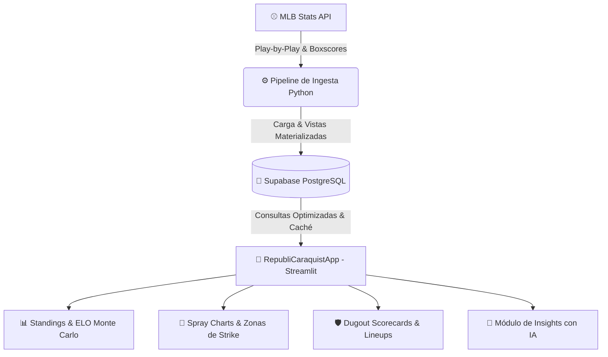

# 🦁 RepubliCaraquistApp
### Plataforma de Analítica Avanzada & Sabermetría para Leones del Caracas (LVBP)

 

**[🌐 Abrir RepubliCaraquistApp en Producción](https://republicaraquistapp.streamlit.app/)**

  <i>Un centro de inteligencia deportiva de nivel Major League aplicado al béisbol invernal venezolano. Datos play-by-play en tiempo real, modelado estadístico, cartografía de batazos, tracking de zonas de strike y analítica predictiva.</i>

---

## 📌 Visión General

**RepubliCaraquistApp** es una suite analítica interactiva y de ingeniería de datos diseñada para monitorear, auditar y proyectar el rendimiento de los **Leones del Caracas** y la **Liga Venezolana de Béisbol Profesional (LVBP)**.

Alimentada directamente por los feeds oficiales de **MLB Stats API**, procesada en una arquitectura moderna sobre **Supabase (PostgreSQL)** y servida en una aplicación web interactiva de alto rendimiento construida en **Streamlit**.

---

## 🚀 Módulos y Funcionalidades de la App

### 🏠 1. Home & Centro de Comando (`🏠 Home`)
* **Dugout Dashboard:** Resumen en vivo de posición, récord general, racha y diferencial de carreras ($RF - RA$).
* **Estadísticas de Situación (56 JJ):**
  * Desglose detallado: *Home Club*, *Visitante*, *Juegos Nocturnos*, *Blanqueos*, *Extrainnings*, *Juegos por 1 Carrera*, *Remontados* y *Arriba al 7mo*.
  * **Terreneadas:** Detección en tiempo real de victorias dejando al rival en el terreno (*walk-off wins* en 9no inning o extras).
  * **Desglose por Día de la Semana:** Récord exhaustivo de Lunes a Domingo.
  * **Decisiones de Pitcheo:** Récord de Abridores, Relevistas y Salvados.
  * **Rendimiento Mensual:** Splits por mes (Octubre, Noviembre, Diciembre).
* **Alineaciones Más Utilizadas:** Desglose del rendimiento, carreras anotadas/permitidas y récord por orden ofensivo.
* **Analista IA & Curiosidades:** Generación de notas y narrativas basadas en el contexto del equipo.

---

### 📊 2. Standings, Pitagórico & Modelo ELO (`📊 Standings`)
* **Tabla de Posiciones Oficial:** Clasificación por fase (*Temporada Regular, Serie Comodín, Round Robin, Serie Final*).
* **Expectativa Pitagórica:** Cálculo de victorias esperadas mediante exponente sabermétrico de carreras.
* **Modelo ELO Rating con Herencia de Fases:**
  * Rating de fuerza relativo por equipo calculado juego a juego.
  * Continuidad histórica con herencia secuencial entre rondas.
  * Proyección de victorias y simulaciones de clasificación por **Monte Carlo**.

---

### 📈 3. Estadísticas Individuales & Sabermetría (`📈 Estadísticas Individuales`)
* **Métricas Ofensivas de Vanguardia:**
  * Tradicionales: $AVG$, $OBP$, $SLG$, $OPS$.
  * Avanzadas: $OPS+$, $wOBA$ (ponderado por constantes de temporada), $BABIP$, $wRAA$, $wRC+$, $WAR$ estimado.
* **Métricas de Pitcheo:**
  * Efectividad y Dominio: $ERA$, $WHIP$, $ERA+$, $K/9$, $BB/9$, $K/BB$, $HR/9$.
  * Sabermetría de Pitcheo Independiente de la Defensa: $FIP$, $FIP+$ y $LOB\%$.

---

### 📈 4. Suite Sabermétrica WPA & Apalancamiento (`📈 Análisis WPA`)
* **Motor Estocástico RE24:** Modelo de *Win Expectancy* de 24 estados ($3\text{ outs} \times 8\text{ combinaciones de bases}$) con distribuciones de carreras restantes y reglas de frontera para extrainnings y *walk-offs*.
* **Curva de Probabilidad de Victoria:** Gráfico dinámico interactivo con áreas de ventaja y tooltips enriquecidos con ocupación visual de bases (`◆ ◇ ◇`), outs, conteo y bateador vs. lanzador.
* **Leverage Index ($LI$):** Medición de la tensión situacional por jugada e inning ($LI \ge 1.5\text{x}$ Alta Presión).
* **Métrica de Oportunismo ($Clutch$):** Desglose de $WPA$, $WPA/LI$ y rendimiento bajo máxima presión.
* **Tablero de Líderes de Temporada (56 JJ):** Rankings acumulados de bateadores, lanzadores y Top 10 momentos más decisivos del año.

---

### 🎯 5. Spray Charts Interactivos (`🎯 Spray Charts`)
* **Cartografía Vectorial de Batazos:** Gráfico 2D calibrado sobre el diamante de juego.
* **Filtros Dinámicos:** Búsqueda por bateador, rango de fechas, juego individual específico y tipo de conexión (*Groundball, Flyball, Line Drive, Pop-up*).

---

### 🎯 6. Disciplina en el Plato y Zonas de Strike (`🎯 Disciplina y Zonas`)
* **Visualización Milimétrica 2D:** Mapeo de coordenadas $plate\_x$ y $plate\_z$ contra el marco reglamentario de la zona de strike.
* **Filtro de Rival Enfrentado:** Perspectiva dual (*Pitcher rival al analizar bateadores* / *Bateador contrario al analizar lanzadores*).
* **Selector Cronológico de Turnos:** Desglose turno a turno con numeración correlativa de lanzamientos (`1`, `2`, `3`...).

---

### ⚡ 7. Análisis Situacional & Matchups BvP (`⚡ Situacional y BvP`)
* **Splits Situacionales:** Rendimiento con corredores en posición anotadora ($RISP$), conteos específicos y situaciones con 2 outs.
* **Historial Bater vs. Pitcher ($BvP$):** Registro histórico y tendencias de enfrentamientos directos entre bateadores y lanzadores.

---

### 🛡️ 8. Bullpen & Lineup Tracking (`🛡️ Bullpen y Lineups`)
* **Dugout Scorecards:** Tarjetas interactivas de alineación defensiva y orden al bate juego a juego con marcador final.
* **Matriz Heatmap 1–9:** Mapa de calor de frecuencia de uso de cada pelotero por posición en el orden ofensivo.
* **Impacto por Jugador Titular:** Récord y porcentaje de victorias del equipo cuando cada pelotero inicia en el lineup.

---

## 🧱 Arquitectura de Datos

---

## 🛠️ Stack Tecnológico

| Capa | Tecnología | Propósito |
|---|---|---|
| **Frontend / App** | [Streamlit](https://streamlit.io/) | Interfaz analítica reactiva multi-página |
| **Data Core** | [Pandas](https://pandas.pydata.org/) & [NumPy](https://numpy.org/) | Procesamiento matricial, sabermetría y agregaciones |
| **Visualización** | [Plotly](https://plotly.com/) | Gráficos interactivos, heatmaps, zonas de strike y spray charts |
| **Base de Datos** | [Supabase](https://supabase.com/) (PostgreSQL) | Almacenamiento relacional de jugadas, partidos y rosters |
| **Fuente de Datos** | [MLB Stats API](https://statsapi.mlb.com/) | Feed oficial de estadísticas y play-by-play LVBP (`sportId=17`) |
| **Despliegue** | [Streamlit Community Cloud](https://streamlit.io/cloud) | Hosting en producción con CI/CD continuo |

---

## 👨‍💻 Autor

**Jorge Leonardo Loreto**  
*Data Scientist & Baseball Analytics Specialist*  
Economista | Especialista en Modelado Predictivo, Inferencia Causal & Béisbol de Invierno  

---

  🦁 Desarrollado con pasión para la fanaticada caraquista y la comunidad de analítica de béisbol.

